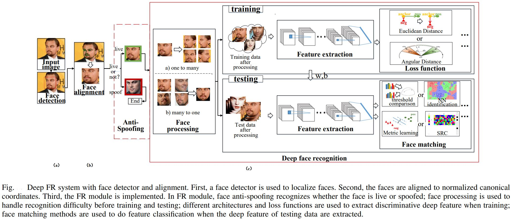

# Tracking & Recognition

## Requirements

| Steps | Status | Description |
| --- | --- | --- |
| Create Requirement.txt File | Pending | Single file containing all modules needed to run this Repo. |

---
# Algorithm Roadmap

## Training

|Steps|Status|Description |
|---|---|---|
|Live Subject Image Collector| Improve | User interface to collect images of subject for training.   **Improve:** Provide visual indications of movements of face for better collection. |
|Face Detector | Done | Detect and Localize people's face (Bounding Boxes).   Single Shot Detector (SSD) with ResNet base network architecture written with Caffe deep framework |
|Face Alignment | Pending | Use landamark points to create a canonical view to align faces|
|Anti-Spoofing | Pending | Use 3D scanner & detect blinking eyes, or use thermal camera to tell 2D images and fake 3D faces from real faces|
|Feature extractor | Done | Facenet architecture for feature extraction written in Pytorch deep framework| 
|Loss Face Matching |Done | SVM for training|

## Testing
|Steps|Status|Description |
|---|---|---|
|Open Video Feed| Done | Live video feed to track & recognize in real time|
|Face Detector | Done | Detect and Localize people's face (Bounding Boxes).   Single Shot Detector (SSD) with ResNet base network architecture written with Caffe deep framework |
|Face Alignment | Pending | Use landamark points to create a canonical view to align faces|
|Anti-Spoofing | Pending | Use 3D scanner & detect blinking eyes, or use thermal camera to tell 2D images and fake 3D faces from real faces|
|Feature extractor | Done | Facenet architecture for feature extraction written in Pytorch deep framework| 
|Face Matching |Done | SVM for testing|

